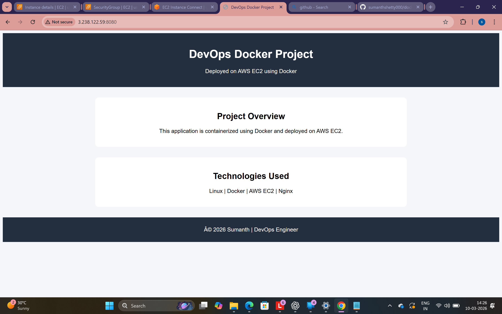

# Dockerized Web Application Deployment on AWS EC2

## Project Overview
This project demonstrates how to containerize and deploy a static web application using Docker on an AWS EC2 instance. The application is served using Nginx inside a Docker container and exposed to the internet through port mapping.

This project showcases fundamental DevOps practices including containerization, cloud deployment, and version control.

---

## Architecture

```
User → Internet → AWS EC2 → Docker Container → Nginx → Web Application
```

---

## Technologies Used

- Linux (Ubuntu)
- Docker
- AWS EC2
- Nginx
- Git & GitHub

---

## Project Structure

```
docker-aws-ec2-devops-project
│
├── Dockerfile
├── index.html
├── README.md
└── Project-output.png
```

---

## Setup Instructions

### 1. Launch EC2 Instance
- AMI: Ubuntu 22.04
- Instance Type: t2.micro

Configure Security Group:

| Port | Purpose |
|-----|--------|
| 22 | SSH Access |
| 8080 | Web Application |

---

### 2. Connect to EC2

```bash
ssh -i your-key.pem ubuntu@<EC2-PUBLIC-IP>
```

---

### 3. Install Docker

```bash
sudo apt update
sudo apt install docker.io -y
sudo systemctl start docker
sudo systemctl enable docker
```

Verify Docker installation:

```bash
docker --version
```

---

### 4. Build Docker Image

```bash
docker build -t devops-web .
```

---

### 5. Run Docker Container

```bash
docker run -d -p 8080:80 devops-web
```

Port mapping:

```
EC2 Port 8080 → Container Port 80
```

---

## Access the Application

Open your browser and navigate to:

```
http://<EC2-PUBLIC-IP>:8080
```

---

## Project Screenshot



---

## DevOps Concepts Practiced

- Docker image creation using Dockerfile
- Container deployment and lifecycle management
- Port mapping between host and container
- AWS EC2 server setup and configuration
- Security group configuration
- Linux server administration
- Version control using Git and GitHub

---

## Author

**Sumanth Shetty**  
Aspiring DevOps Engineer
